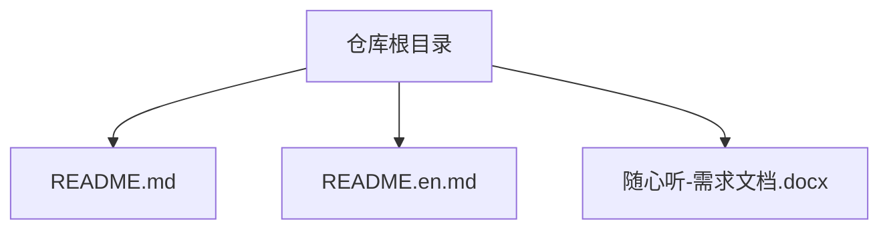
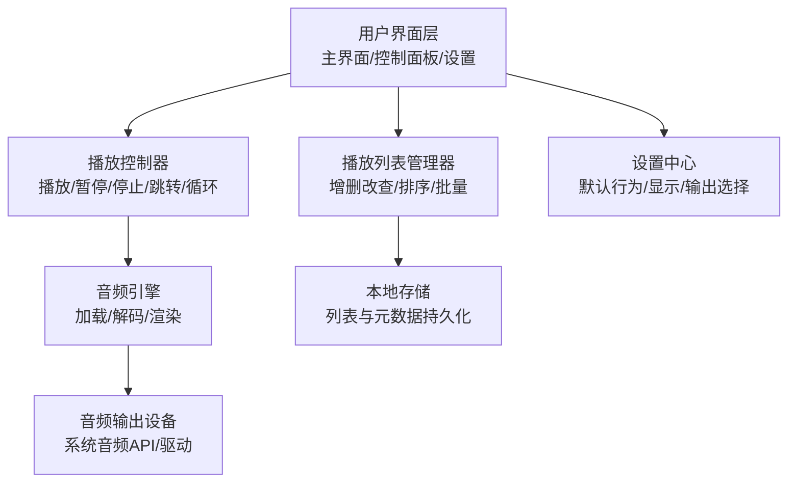
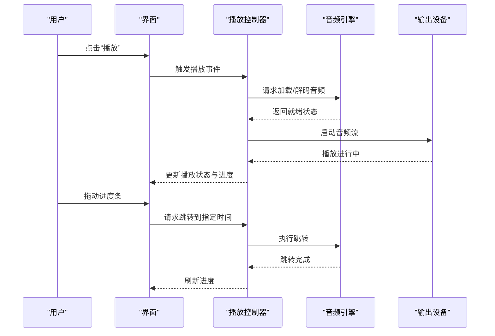
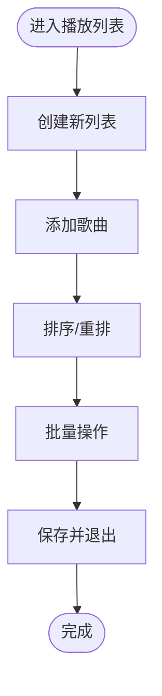
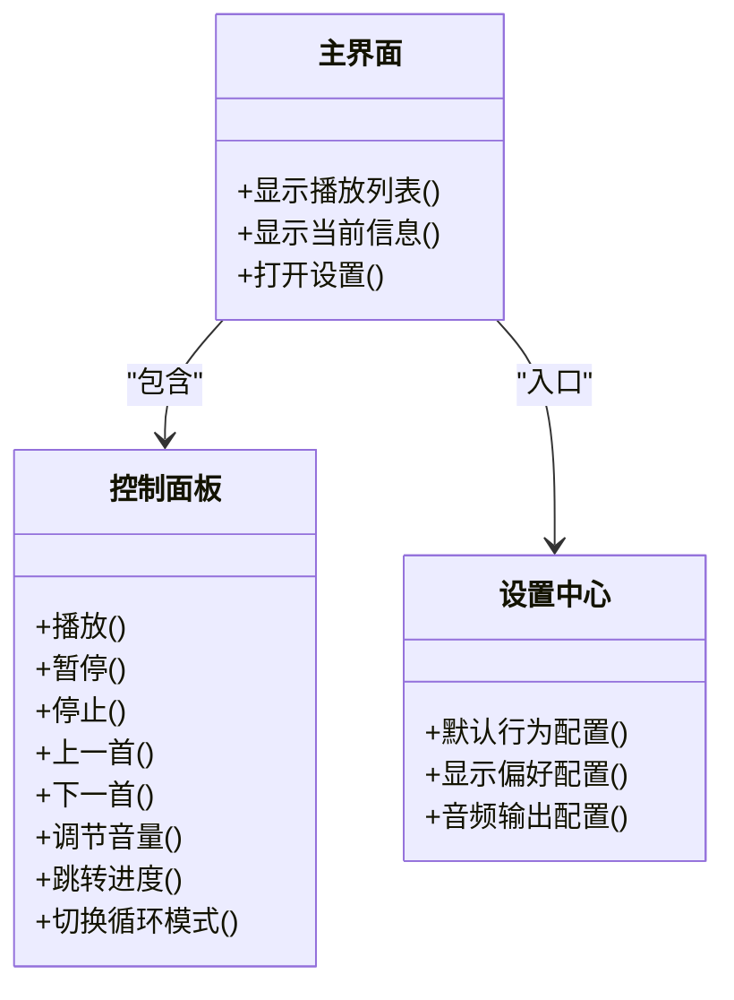
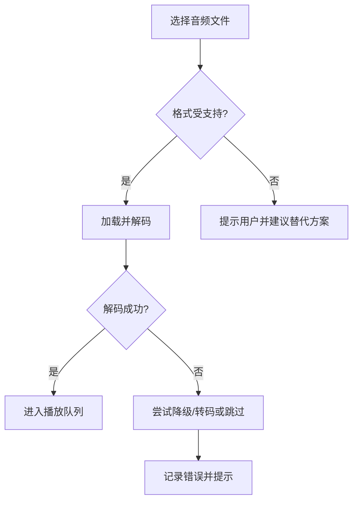
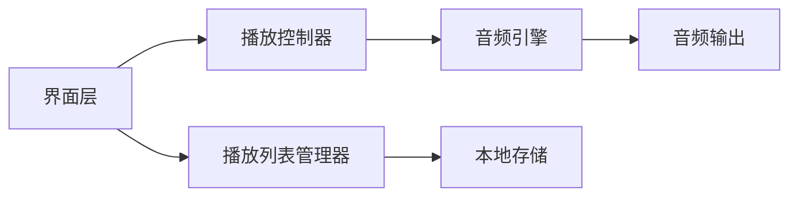

# 功能详解

<cite>
**本文引用的文件**   
- [README.md](file://README.md)
- [README.en.md](file://README.en.md)
</cite>

## 目录
1. [简介](#简介)
2. [项目结构](#项目结构)
3. [核心组件](#核心组件)
4. [架构总览](#架构总览)
5. [详细组件分析](#详细组件分析)
6. [依赖分析](#依赖分析)
7. [性能考虑](#性能考虑)
8. [故障排查指南](#故障排查指南)
9. [结论](#结论)
10. [附录](#附录)

## 简介
本文件为“随心听”应用的功能指南，聚焦于音频播放与播放列表管理、用户界面交互、格式支持与兼容性、操作步骤与快捷键、以及高级配置与最佳实践。由于当前仓库仅包含说明性文档（README），未包含源代码实现，因此本文在“代码级细节”部分将明确标注“无源码依据”，并在可验证范围内提供基于需求目标的通用设计建议与操作指引。

## 项目结构
当前仓库根目录包含以下文件：
- README.md：中文说明模板
- README.en.md：英文说明模板
- 需求文档（Word 格式）：未在仓库中提供可直接解析的文本内容

**图表来源**
- [README.md:1-40](file://README.md#L1-L40)
- [README.en.md:1-37](file://README.en.md#L1-L37)

**章节来源**
- [README.md:1-40](file://README.md#L1-L40)
- [README.en.md:1-37](file://README.en.md#L1-L37)

## 核心组件
本节概述“随心听”应具备的核心能力模块，便于后续展开详细功能指南。

- 音频引擎
  - 音频文件加载与解码
  - 播放控制（播放/暂停/停止）
  - 音量调节与静音切换
  - 进度控制（跳转、快进/快退、循环模式）
- 播放列表管理
  - 创建/编辑/删除播放列表
  - 歌曲排序与批量操作（多选、拖拽重排）
  - 持久化存储与同步
- 用户界面
  - 主界面布局（播放器面板、列表区、设置入口）
  - 控制面板交互（按钮、滑块、键盘快捷键）
  - 设置选项（默认行为、显示偏好、音频输出）
- 格式支持与兼容性
  - 常见音频格式支持策略
  - 平台差异与降级方案
  - 错误提示与恢复机制

[本节为概念性概述，不直接分析具体源文件]

## 架构总览
下图展示“随心听”的高层模块划分与数据流向，便于理解各功能之间的关系。

[此图为概念性架构图，不映射到具体源码文件]

## 详细组件分析

### 音频播放核心功能
- 音频文件加载
  - 目标：从本地路径或媒体库读取音频并准备解码。
  - 关键点：异步加载、预缓冲、错误回退（如格式不支持时提示）。
- 播放控制
  - 目标：提供播放、暂停、停止、上一首/下一首等基础控制。
  - 关键点：状态机清晰（空闲/加载中/播放/暂停/停止）、UI 与状态同步。
- 音量调节
  - 目标：全局音量与静音切换。
  - 关键点：音量范围映射、跨设备一致性、UI 即时反馈。
- 进度控制
  - 目标：拖动进度条、快进/快退、循环模式（单曲/列表/随机）。
  - 关键点：高精度时间戳、节流更新、边界处理（开始/结束）。

[此图为概念性流程图，不映射到具体源码文件]

**章节来源**
- [README.md:1-40](file://README.md#L1-L40)
- [README.en.md:1-37](file://README.en.md#L1-L37)

### 播放列表管理功能
- 创建/编辑/删除
  - 新建空列表、导入本地音频、批量添加。
  - 编辑名称、封面、备注；删除列表或清空列表。
- 歌曲排序与批量操作
  - 拖拽排序、按标题/时长/添加时间排序。
  - 多选后批量移动、删除、加入其他列表。
- 持久化与同步
  - 列表与元数据本地保存，必要时支持云端同步。

[此图为概念性流程图，不映射到具体源码文件]

**章节来源**
- [README.md:1-40](file://README.md#L1-L40)
- [README.en.md:1-37](file://README.en.md#L1-L37)

### 用户界面交互设计
- 主界面布局
  - 顶部：应用标题与全局搜索。
  - 中部左侧：播放列表区（树形/卡片视图）。
  - 中部右侧：当前播放信息与歌词/封面。
  - 底部：控制面板（播放/暂停/停止、上一首/下一首、音量、进度条、循环模式）。
- 控制面板操作
  - 鼠标/触控：点击、长按、拖拽。
  - 键盘快捷键：空格（播放/暂停）、左右箭头（快进/快退）、上下箭头（音量）、Home/End（跳到开头/结尾）。
- 设置选项配置
  - 默认行为：启动时是否继续上次播放、默认循环模式。
  - 显示偏好：主题、字体大小、列表视图。
  - 音频输出：选择输出设备、采样率/位深（若可用）。

[此图为概念性类图，不映射到具体源码文件]

**章节来源**
- [README.md:1-40](file://README.md#L1-L40)
- [README.en.md:1-37](file://README.en.md#L1-L37)

### 音频格式支持与兼容性处理
- 支持策略
  - 优先使用系统原生解码器，确保兼容性与性能。
  - 对不支持的格式进行友好提示并提供转换/转码建议。
- 平台差异
  - Windows/macOS/Linux 的音频 API 不同，需抽象统一接口。
  - 移动端与桌面端差异较大，需分别适配。
- 错误处理
  - 加载失败：重试、降级、提示用户检查文件或权限。
  - 解码异常：跳过损坏片段、记录日志、允许用户手动修复。

[此图为概念性流程图，不映射到具体源码文件]

**章节来源**
- [README.md:1-40](file://README.md#L1-L40)
- [README.en.md:1-37](file://README.en.md#L1-L37)

### 操作步骤与快捷键说明
- 基本操作
  - 播放/暂停：点击控制面板播放按钮或按下空格键。
  - 停止：点击停止按钮。
  - 上一首/下一首：点击对应按钮或使用左/右方向键。
  - 音量调节：点击音量图标或使用上/下方向键。
  - 进度跳转：拖动进度条或按 Home/End 快速定位。
- 播放列表操作
  - 新建列表：点击“新建”按钮，输入名称并保存。
  - 添加歌曲：选中歌曲并点击“添加到列表”，或拖拽至列表区域。
  - 排序：右键菜单选择排序方式，或直接拖拽调整顺序。
  - 批量操作：勾选多首歌曲后执行删除/移动/复制等操作。
- 设置配置
  - 打开设置中心，修改默认行为、显示偏好与音频输出。
  - 保存后立即生效，必要时重启应用以完全应用更改。

[本节为通用操作指引，不直接分析具体源文件]

### 高级配置选项
- 音频输出
  - 选择默认输出设备、启用降噪/均衡器（若系统支持）。
- 播放行为
  - 启动恢复、自动播放下一首、随机/循环模式默认值。
- 性能与缓存
  - 预缓冲大小、内存占用上限、后台播放策略。
- 无障碍与国际化
  - 屏幕阅读器支持、高对比度主题、多语言切换。

[本节为通用配置建议，不直接分析具体源文件]

### 实际使用场景与最佳实践
- 通勤场景
  - 开启“随机播放”与“自动下一首”，减少手动操作。
  - 使用耳机按键快捷控制播放/暂停。
- 学习/工作专注
  - 设置“单曲循环”白噪音或轻音乐，避免打扰。
  - 关闭通知与锁屏播放，降低干扰。
- 家庭娱乐
  - 建立多个播放列表（电影原声、爵士、古典），按需切换。
  - 使用蓝牙音箱输出，提升音质体验。
- 最佳实践
  - 定期整理播放列表，删除无效链接。
  - 遇到播放异常时，先检查文件格式与权限，再尝试重新加载。

[本节为通用建议，不直接分析具体源文件]

## 依赖分析
当前仓库未包含源代码，无法进行实际的依赖关系分析。以下为概念性依赖示意，帮助理解模块间关系。

[此图为概念性依赖图，不映射到具体源码文件]

**章节来源**
- [README.md:1-40](file://README.md#L1-L40)
- [README.en.md:1-37](file://README.en.md#L1-L37)

## 性能考虑
- 预缓冲与流式播放：在网络或大文件场景下提升流畅度。
- 资源释放：离开页面或停止播放时及时释放解码器与句柄。
- 线程模型：UI 与音频线程分离，避免卡顿。
- 内存管理：限制缓存大小，避免 OOM。
- 功耗优化：后台播放时降低采样率或启用节能模式。

[本节为通用性能建议，不直接分析具体源文件]

## 故障排查指南
- 无法加载音频
  - 检查文件路径与权限，确认格式受支持。
  - 尝试在其他播放器中打开同一文件，排除文件损坏。
- 播放卡顿或中断
  - 降低预缓冲大小或关闭不必要的后台任务。
  - 切换输出设备或更新音频驱动。
- 音量异常
  - 检查系统音量与应用程序音量是否被静音。
  - 重置音量设置并重启应用。
- 播放列表不同步
  - 清理本地缓存并重新加载列表。
  - 检查存储权限与磁盘空间。

[本节为通用排查建议，不直接分析具体源文件]

## 结论
“随心听”作为音频播放与播放列表管理应用，其核心在于稳定的音频引擎、清晰的播放控制逻辑、友好的用户界面与完善的兼容性处理。尽管当前仓库未包含源代码，本文仍提供了完整的功能指南、操作流程与最佳实践，可作为后续开发与测试的参考蓝图。

[本节为总结性内容，不直接分析具体源文件]

## 附录
- 术语表
  - 音频引擎：负责音频加载、解码与输出的核心模块。
  - 播放控制器：封装播放状态与用户操作的中间层。
  - 播放列表：用户自定义的歌曲集合，支持排序与批量操作。
- 参考链接
  - 仓库说明：[README.md](file://README.md)、[README.en.md](file://README.en.md)

[本节为补充信息，不直接分析具体源文件]