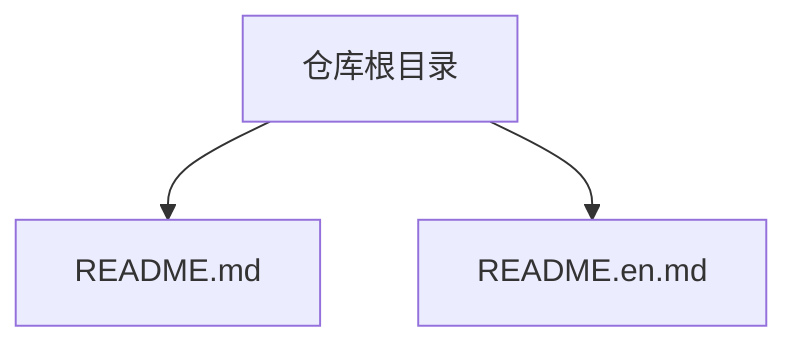
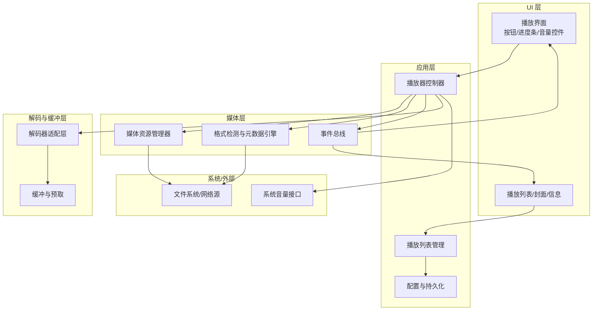
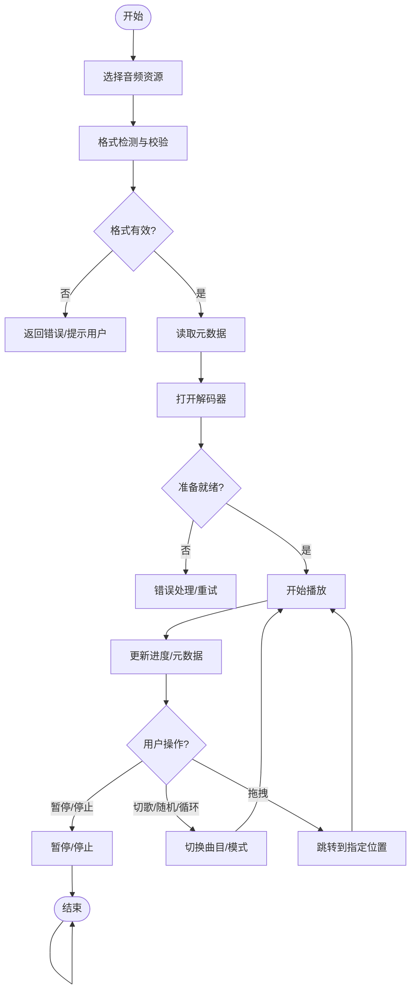

# 音频播放功能

<cite>
**本文引用的文件**   
- [README.md](file://README.md)
- [README.en.md](file://README.en.md)
</cite>

## 目录
1. [简介](#简介)
2. [项目结构](#项目结构)
3. [核心组件](#核心组件)
4. [架构总览](#架构总览)
5. [详细组件分析](#详细组件分析)
6. [依赖分析](#依赖分析)
7. [性能考虑](#性能考虑)
8. [故障排查指南](#故障排查指南)
9. [结论](#结论)
10. [附录](#附录)

## 简介
本技术文档围绕“音频播放功能”的需求，系统化阐述音频文件加载、格式检测与元数据提取、播放控制（播放/暂停/停止、上一首/下一首、随机与循环）、进度条拖拽、音量控制（滑块、静音、系统同步）、解码器集成与缓冲区管理、内存优化策略、事件处理（播放完成、错误、缓冲状态）以及性能优化与常见问题解决方案。由于当前仓库仅包含说明性文档，未提供具体实现代码，本文在“概念性概述”部分给出通用工程化方案与最佳实践，并在需要时以“章节来源”标注可追溯的仓库内容。

## 项目结构
当前仓库为项目说明页，包含中英文 README 文件，用于介绍项目背景与贡献方式。实际音频播放功能的源代码尚未提交至该仓库。

图表来源
- [README.md:1-40](file://README.md#L1-L40)
- [README.en.md:1-37](file://README.en.md#L1-L37)

章节来源
- [README.md:1-40](file://README.md#L1-L40)
- [README.en.md:1-37](file://README.en.md#L1-L37)

## 核心组件
基于需求文档的目标，建议将音频播放子系统划分为以下核心组件：
- 媒体资源管理器：负责音频文件选择、路径解析、URL/本地路径统一抽象、预取与缓存策略。
- 格式检测与元数据引擎：识别 MP3/WAV/FLAC 等格式，读取标题、艺术家、专辑、时长、封面等元数据。
- 播放器控制器：封装播放/暂停/停止、上一首/下一首、随机与循环模式、播放列表管理。
- 进度与时间轴：驱动 UI 进度条、支持拖拽跳转、显示剩余时间与百分比。
- 音量与混音控制：音量滑块、静音切换、系统音量同步、声道平衡（可选）。
- 解码与缓冲层：对接底层解码器（平台原生或第三方库），管理环形缓冲区、自适应码率与预缓冲。
- 事件总线：统一分发播放完成、错误、缓冲状态、元数据更新等事件。
- 配置与持久化：保存用户偏好（音量、循环/随机模式、最近播放列表）。

章节来源
- [README.md:1-40](file://README.md#L1-L40)

## 架构总览
下图展示一个通用的客户端音频播放系统分层架构，便于理解各模块职责与交互关系。

[此图为概念性架构图，不直接映射到具体源码文件]

## 详细组件分析

### 媒体资源管理与格式检测
- 支持的音频格式
  - 常见无损/有损格式：MP3、WAV、FLAC、AAC、OGG、M4A 等。
  - 流式协议：HTTP/HTTPS、HLS/DASH（视平台能力而定）。
- 文件格式检测
  - 优先通过文件扩展名快速判断；对无扩展名或伪装后缀的文件，采用魔数（Magic Number）与头部校验进行二次确认。
  - 针对容器格式（如 M4A/MP4）需区分音频轨道与视频轨道。
- 元数据提取
  - ID3v1/v2（MP3）、RIFF/WAVE（WAV）、Vorbis Comment（FLAC/OGG）、QuickTime Metadata（M4A/AAC）。
  - 字段包括：标题、艺术家、专辑、年份、流派、曲目号、时长、采样率、比特率、封面图片等。
- 异常与容错
  - 损坏文件、缺失关键头、编码不支持时的降级策略（提示用户、跳过、记录日志）。

章节来源
- [README.md:1-40](file://README.md#L1-L40)

### 播放控制与播放列表
- 基础控制
  - 播放/暂停/停止：维护内部状态机（空闲、加载中、播放中、暂停、结束）。
  - 上一首/下一首：按顺序或随机模式切换；支持单曲循环、列表循环、随机播放。
- 播放列表
  - 动态增删改查；持久化最近播放与收藏；断点续播（可选）。
- 边界条件
  - 空列表、重复项去重、跨设备/会话恢复。

章节来源
- [README.md:1-40](file://README.md#L1-L40)

### 进度条与时间轴
- 实时进度
  - 使用高精度定时器或渲染帧回调驱动 UI 更新，避免掉帧。
- 拖拽跳转
  - 拖拽开始/结束分别触发“预览位置”和“精确跳转”，必要时进行解码定位（seek）。
- 显示格式
  - 自动转换秒数为 mm:ss 或 hh:mm:ss，并显示剩余时间。

章节来源
- [README.md:1-40](file://README.md#L1-L40)

### 音量与混音控制
- 音量滑块
  - 线性或指数刻度映射，兼顾感知均匀性与操作精度。
- 静音切换
  - 记忆上次音量，静音后恢复。
- 系统音量同步
  - 读取/设置系统主音量（受平台权限与沙箱限制影响），并提供回退策略。

章节来源
- [README.md:1-40](file://README.md#L1-L40)

### 解码器集成与缓冲区管理
- 解码器适配
  - 平台原生 API（如 Android MediaCodec、iOS AVAudioSession/AVPlayer、Windows Media Foundation、macOS AVFoundation、Web Audio API）或第三方库（FFmpeg、libmpg123、libsndfile 等）。
  - 统一接口抽象：打开、解码帧、释放、错误码归一化。
- 缓冲策略
  - 环形缓冲区 + 预缓冲阈值；根据网络抖动与 CPU 占用动态调整。
  - 大文件分块解码，避免一次性加载导致峰值内存。
- 内存优化
  - 及时释放已解码帧；复用解码上下文；按需加载封面图并压缩缓存。

章节来源
- [README.md:1-40](file://README.md#L1-L40)

### 事件处理与错误恢复
- 事件类型
  - 播放完成、暂停、停止、缓冲不足、缓冲充足、元数据就绪、错误（解码失败、IO 错误、权限不足）。
- 错误恢复
  - 自动重试（带退避）、降级到更低码率、提示用户检查文件或网络。
- 日志与上报
  - 结构化日志、关键指标埋点（卡顿率、首开耗时、错误分布）。

章节来源
- [README.md:1-40](file://README.md#L1-L40)

### 概念性流程图：播放流程

[此图为概念性流程图，不直接映射到具体源码文件]

## 依赖分析
- 内部依赖
  - 播放器控制器依赖媒体资源管理器、解码适配层、事件总线与配置模块。
  - UI 层依赖控制器暴露的状态与事件。
- 外部依赖
  - 操作系统音频栈、文件系统、网络栈、系统音量接口。
- 耦合与内聚
  - 通过适配器与事件总线降低耦合；将解码细节封装在适配层，提升内聚。

[本节为概念性分析，无需列出具体文件来源]

## 性能考虑
- 首开耗时优化
  - 预读前 N 秒音频；异步加载元数据与封面；懒加载大图。
- 卡顿与缓冲
  - 自适应预缓冲阈值；在网络波动时提高缓冲水位；CPU 高负载时降低解码复杂度。
- 内存占用
  - 控制单帧大小与缓冲池上限；及时释放不再使用的对象；避免在主线程做 IO。
- 功耗与后台
  - 合理设置音频焦点与后台播放策略；避免唤醒锁滥用。

[本节为通用指导，无需列出具体文件来源]

## 故障排查指南
- 无法播放
  - 检查文件完整性与编码是否受支持；查看解码器初始化日志；验证权限与路径。
- 无声或杂音
  - 检查系统音量与输出设备；确认声道配置与采样率匹配；排查解码器参数。
- 卡顿严重
  - 观察缓冲水位与网络质量；适当增大预缓冲；降低码率或启用硬件解码。
- 元数据显示异常
  - 确认标签版本兼容性；对损坏标签进行容错处理；必要时回退到默认值。

[本节为通用指导，无需列出具体文件来源]

## 结论
本文从架构与组件层面梳理了音频播放功能的关键设计与实现要点，涵盖加载、检测、元数据、控制、进度、音量、解码与缓冲、事件与错误处理、性能优化与排障。由于当前仓库未包含具体实现代码，上述内容为工程化落地建议与最佳实践。建议在后续迭代中补充源码与单元测试，以便进一步细化依赖关系与性能基准。

[本节为总结性内容，无需列出具体文件来源]

## 附录
- 术语
  - 元数据：描述音频内容的结构化信息，如标题、艺术家、专辑、时长等。
  - 缓冲：在播放前预先加载一定时长的音频数据，以降低卡顿风险。
  - 解码：将压缩音频数据转换为 PCM 原始波形数据的过程。
- 参考链接
  - 仓库说明：[README.md](file://README.md)、[README.en.md](file://README.en.md)