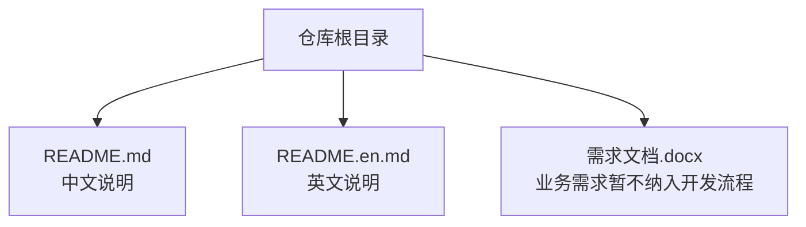
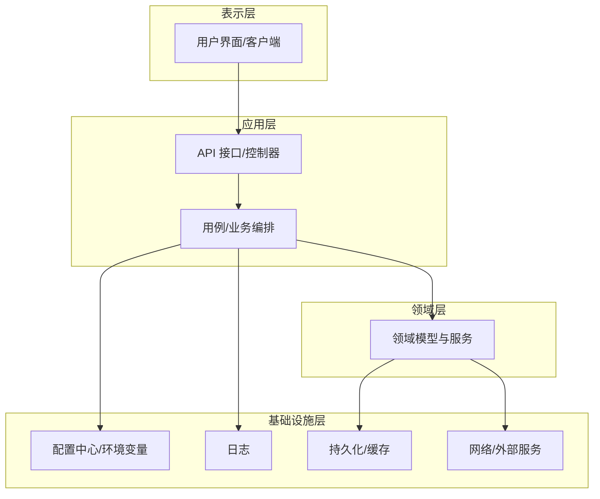

# 开发指南

<cite>
**本文引用的文件**   
- [README.md](file://README.md)
- [README.en.md](file://README.en.md)
</cite>

## 目录
1. [简介](#简介)
2. [项目结构](#项目结构)
3. [核心组件](#核心组件)
4. [架构总览](#架构总览)
5. [详细组件分析](#详细组件分析)
6. [依赖分析](#依赖分析)
7. [性能考虑](#性能考虑)
8. [故障排查指南](#故障排查指南)
9. [结论](#结论)
10. [附录](#附录)

## 简介
本指南面向“随心听”项目的开发者，目标是帮助你在本地快速搭建开发环境、理解代码结构与模块划分、遵循编码规范与最佳实践、完成测试与调试、并掌握 Git 协作与贡献流程。当前仓库为初始模板阶段，README 中提供了基础说明与贡献指引；随着项目演进，建议将更多工程化细节沉淀到文档与配置文件中，以便团队协作更高效。

## 项目结构
目前仓库包含以下文件：
- README.md：中文说明（含安装、使用、参与贡献等占位内容）
- README.en.md：英文说明（对应占位内容）
- 需求文档（Word 格式，不在本文展开）

由于仓库尚未包含源代码与构建配置，本节以概念性结构为主，便于后续在引入实际代码后对齐组织方式。

[无图表来源，因为该图为概念性结构示意]

**章节来源**
- [README.md:1-40](file://README.md#L1-L40)
- [README.en.md:1-37](file://README.en.md#L1-L37)

## 核心组件
当前仓库未包含可执行代码或模块实现，因此不存在运行时核心组件。建议在后续引入代码时，按功能域进行模块化拆分，例如：
- 应用入口与生命周期管理
- 业务逻辑层（领域服务/用例）
- 数据访问层（仓储/DAO）
- 基础设施（日志、配置、网络、存储）
- 测试（单元测试、集成测试、性能测试）
- 工具与脚本（构建、发布、CI）

[本节为通用指导，不涉及具体文件分析]

## 架构总览
在尚无源码的情况下，推荐采用分层与模块化相结合的架构思路，确保职责清晰、耦合可控、易于扩展与测试。

[无图表来源，因为该图为概念性架构示意]

## 详细组件分析
当前仓库不包含具体代码实现，无法对组件进行代码级分析。建议在后续引入代码后，针对每个关键组件补充如下内容：
- 类图/时序图/流程图，展示内部关系与调用链
- 输入输出契约、错误码与异常策略
- 性能特征与优化点
- 测试覆盖与边界条件

[本节为通用指导，不涉及具体文件分析]

## 依赖分析
当前仓库未包含依赖清单或构建脚本，无法进行依赖关系分析。建议在引入代码后，提供依赖声明与版本锁定，并在 README 中给出安装与构建步骤。

[本节为通用指导，不涉及具体文件分析]

## 性能考虑
- 明确性能目标与指标（如响应时间、吞吐、资源占用）
- 优先在设计与接口层面降低不必要的计算与 I/O
- 对热点路径进行基准测试与压测，定位瓶颈
- 合理缓存与异步化，避免阻塞主流程
- 监控与告警贯穿上线前后

[本节为通用指导，不涉及具体文件分析]

## 故障排查指南
- 日志：统一日志级别与格式，关键路径埋点，便于回溯
- 错误处理：定义错误分类与恢复策略，避免吞掉异常
- 配置与环境：区分开发/测试/生产配置，敏感信息不入仓
- 复现与最小化：尽量缩小问题范围，提供可复现场景与数据
- 回归验证：修复后补充测试用例，防止再次发生

[本节为通用指导，不涉及具体文件分析]

## 结论
当前仓库处于初始化阶段，主要包含 README 与需求文档。建议尽快落地工程化配置与代码骨架，完善构建、测试、文档与协作流程，使团队能高效协同推进“随心听”项目。

[本节为总结性内容，不涉及具体文件分析]

## 附录

### 开发环境搭建（建议）
- IDE 选择与插件：根据技术栈选择合适的 IDE 与必要插件（语言支持、格式化、静态检查、调试器）
- 运行环境：安装必要的运行时与 SDK，配置环境变量
- 依赖安装：通过包管理器安装依赖，必要时锁定版本
- 构建工具：配置构建脚本与任务，支持本地构建与打包
- 数据库与中间件：准备本地开发所需的数据库、消息队列、缓存等

[本节为通用指导，不涉及具体文件分析]

### 代码结构与模块划分（建议）
- 按功能域组织目录，保持高内聚、低耦合
- 公共能力抽取为共享库或工具模块
- 测试与源码分离，按被测单元组织测试目录
- 配置文件集中管理，区分环境与用途

[本节为通用指导，不涉及具体文件分析]

### 编码规范与最佳实践（建议）
- 命名约定：统一变量、函数、类、模块的命名风格
- 注释标准：关键逻辑、接口契约、复杂算法需有清晰注释
- 错误处理：明确错误类型、传播与恢复策略
- 安全与合规：避免硬编码敏感信息，注意输入校验与权限控制
- 可读性与可维护性：控制复杂度，适度拆分函数与模块

[本节为通用指导，不涉及具体文件分析]

### 测试策略（建议）
- 单元测试：覆盖核心逻辑与边界条件，保证快速反馈
- 集成测试：验证模块间交互与外部依赖的正确性
- 性能测试：对关键路径进行基准与压力测试
- 持续集成：在 CI 中自动执行测试与质量门禁

[本节为通用指导，不涉及具体文件分析]

### Git 工作流程（基于仓库现有说明）
仓库 README 已提供基础贡献流程，建议在此基础上细化分支策略与提交规范：
- 分支管理：主干稳定，特性分支命名参考 Feat_xxx
- 提交规范：语义化提交信息，描述变更动机与影响
- 代码审查：提交 PR 前自审，合并前至少一人审查
- 回滚策略：保留可追溯的提交历史，必要时打标签

**章节来源**
- [README.md:24-30](file://README.md#L24-L30)
- [README.en.md:21-26](file://README.en.md#L21-L26)

### 贡献代码与 Pull Request 流程（基于仓库现有说明）
- Fork 本仓库
- 新建 Feat_xxx 分支
- 提交代码
- 新建 Pull Request

**章节来源**
- [README.md:24-30](file://README.md#L24-L30)
- [README.en.md:21-26](file://README.en.md#L21-L26)