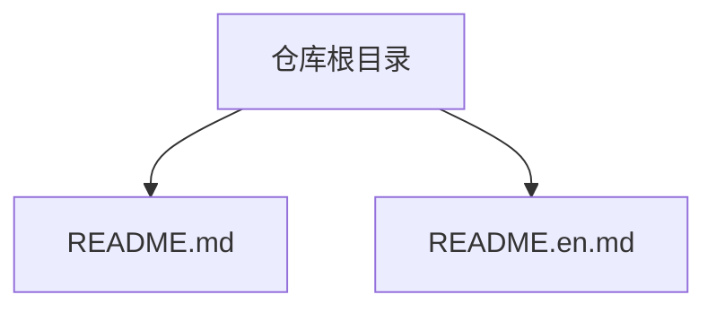
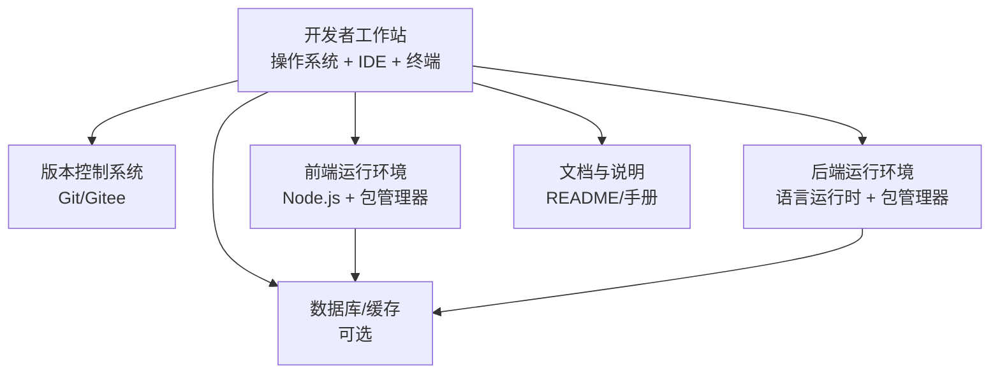
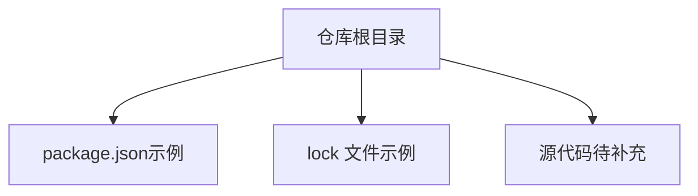

# 环境搭建

<cite>
**本文引用的文件**   
- [README.md](file://README.md)
- [README.en.md](file://README.en.md)
</cite>

## 目录
1. [简介](#简介)
2. [项目结构](#项目结构)
3. [核心组件](#核心组件)
4. [架构总览](#架构总览)
5. [详细组件分析](#详细组件分析)
6. [依赖分析](#依赖分析)
7. [性能考虑](#性能考虑)
8. [故障排查指南](#故障排查指南)
9. [结论](#结论)
10. [附录](#附录)

## 简介
本指南面向“随心听”项目的开发者，目标是帮助你在本地快速完成开发环境的搭建与验证。当前仓库为初始模板，尚未包含具体的构建脚本、配置文件或源代码。因此，本节提供通用且可操作的步骤，帮助你准备系统、安装工具链、配置环境变量，并给出验证方法。当你后续将实际代码与构建脚本引入仓库后，可按相同流程进行适配与扩展。

## 项目结构
目前仓库根目录仅包含中英文 README 文件，用于说明项目基本信息与贡献方式。待补充的源码、构建脚本与配置文件建议按功能分层组织（例如：前端、后端、脚本、文档等），以便后续维护与环境配置管理。

**图示来源** 
- [README.md:1-40](file://README.md#L1-L40)
- [README.en.md:1-37](file://README.en.md#L1-L37)

**章节来源**
- [README.md:1-40](file://README.md#L1-L40)
- [README.en.md:1-37](file://README.en.md#L1-L37)

## 核心组件
由于仓库尚未包含具体实现，以下列出在典型多语言项目中常见的环境与工具组件，供你参考并在引入实际代码后进行对齐：
- 运行时与编译器：如 Node.js/Python/Java/C++ 等（根据实际技术栈选择）
- 包管理器：npm/yarn/pip/maven/gradle/cargo 等
- 构建与测试工具：webpack/vite/pytest/jest/make 等
- 版本控制与协作：Git、IDE（VS Code/IntelliJ/CLion 等）
- 数据库与中间件（如有）：MySQL/PostgreSQL/Redis 等

提示：当仓库加入具体工程文件（如 package.json、requirements.txt、pom.xml、CMakeLists.txt 等）后，请据此更新本节的工具链与依赖清单。

[本节不直接分析具体文件，故无“章节来源”]

## 架构总览
下图展示了一个通用的前后端分离式应用的环境关系，便于理解各组件的职责与交互。该图为概念性示意，不代表当前仓库的实际实现。

[此图为概念性架构图，未映射到具体源文件，故无“图示来源”]

## 详细组件分析
### 系统要求与前置条件
- 操作系统：Windows 10/11、macOS 10.15+、主流 Linux 发行版（Ubuntu/CentOS 等）
- 磁盘空间：至少预留 10–20 GB 用于工具链与依赖缓存
- 网络：可访问公共包源与 Git 仓库
- 权限：具备管理员/Root 权限以安装系统级依赖（必要时）

[本节为通用指导，不直接分析具体文件，故无“章节来源”]

### 开发工具与语言运行时
- 编辑器/IDE：推荐 VS Code、WebStorm、IntelliJ IDEA、CLion 等
- 终端：Windows 建议使用 PowerShell 或 WSL；macOS/Linux 使用默认终端
- 版本控制：安装 Git 并配置用户信息
- 语言运行时与包管理器：依据实际技术栈安装（见“核心组件”）

[本节为通用指导，不直接分析具体文件，故无“章节来源”]

### 依赖库与构建工具
- 前端：安装 Node.js 与 npm/yarn，执行依赖安装命令
- 后端：安装对应语言的运行时与包管理器，执行依赖安装命令
- 构建与测试：安装构建脚本所需的工具，执行构建与测试命令
- 数据库/中间件：按需安装并启动服务，配置连接参数

[本节为通用指导，不直接分析具体文件，故无“章节来源”]

### 环境变量与路径配置
- PATH：确保 Node.js/Python/Java 等可执行文件所在目录已加入 PATH
- 代理与镜像源：若受网络限制，配置包管理器镜像与代理
- 密钥与证书：如需访问私有仓库或调用外部 API，提前配置认证信息

[本节为通用指导，不直接分析具体文件，故无“章节来源”]

### 不同操作系统下的安装步骤
- Windows
  - 安装 Git、Node.js（或所需语言运行时）、IDE
  - 打开 PowerShell，验证工具版本
  - 克隆仓库，进入项目目录，执行依赖安装与构建命令
- macOS
  - 通过 Homebrew 安装 Git、Node.js 等
  - 打开终端，验证工具版本
  - 克隆仓库，进入项目目录，执行依赖安装与构建命令
- Linux
  - 使用发行版包管理器安装 Git、Node.js 等
  - 打开终端，验证工具版本
  - 克隆仓库，进入项目目录，执行依赖安装与构建命令

[本节为通用指导，不直接分析具体文件，故无“章节来源”]

### 常见问题与解决方案
- 无法访问公网或下载缓慢：切换至国内镜像源或配置代理
- 权限不足导致安装失败：使用管理员/Root 权限或改用用户级安装
- 端口冲突或服务未启动：检查数据库/中间件是否运行，修改端口或停止占用进程
- 环境变量未生效：重启终端或重新加载 shell 配置

[本节为通用指导，不直接分析具体文件，故无“章节来源”]

### 环境验证方法
- 基础工具验证：分别运行 git --version、node -v、python --version 等，确认输出符合预期
- 依赖安装验证：执行依赖安装命令，观察无报错且生成锁文件或缓存
- 构建与运行验证：执行构建命令与启动命令，确认服务正常监听或产物生成成功
- 单元测试验证：执行测试命令，确认用例通过

[本节为通用指导，不直接分析具体文件，故无“章节来源”]

## 依赖分析
当前仓库未包含任何依赖声明或构建脚本，因此不存在直接的依赖关系图。建议在引入实际代码后，添加如下文件以明确依赖：
- 前端：package.json、yarn.lock/package-lock.json
- Python：requirements.txt、pyproject.toml
- Java：pom.xml、build.gradle
- C/C++：CMakeLists.txt、Makefile

[此图为概念性依赖示意，未映射到具体源文件，故无“图示来源”]

**章节来源**
- [README.md:1-40](file://README.md#L1-L40)
- [README.en.md:1-37](file://README.en.md#L1-L37)

## 性能考虑
- 优先使用本地缓存与镜像源，减少网络开销
- 合理划分模块与依赖，避免全量重建
- 并行化构建与测试任务（视工具支持情况）
- 对数据库与中间件进行资源隔离与限流，避免影响开发体验

[本节为通用指导，不直接分析具体文件，故无“章节来源”]

## 故障排查指南
- 日志定位：查看构建与运行日志，关注错误堆栈与警告信息
- 最小复现：剥离无关依赖与模块，逐步缩小问题范围
- 网络问题：检查代理、DNS、防火墙与镜像源可用性
- 权限问题：确认文件读写权限与用户组设置
- 版本兼容：核对运行时、包管理器与依赖之间的版本矩阵

[本节为通用指导，不直接分析具体文件，故无“章节来源”]

## 结论
当前仓库为初始模板，尚未包含具体实现与构建配置。建议尽快引入实际的源代码与依赖声明文件，并据此完善本指南中的工具链、依赖清单、构建与验证步骤。在此之前，可按照本指南的通用流程完成基础环境准备与验证。

[本节为总结性内容，不直接分析具体文件，故无“章节来源”]

## 附录
- 贡献流程：参考仓库 README 中的参与贡献说明
- 文档语言：可使用 README.md 与 README.en.md 分别维护中文与英文说明

**章节来源**
- [README.md:24-29](file://README.md#L24-L29)
- [README.en.md:21-26](file://README.en.md#L21-L26)