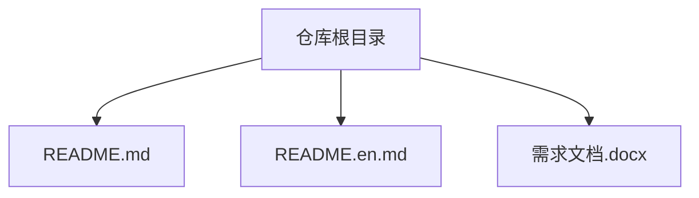
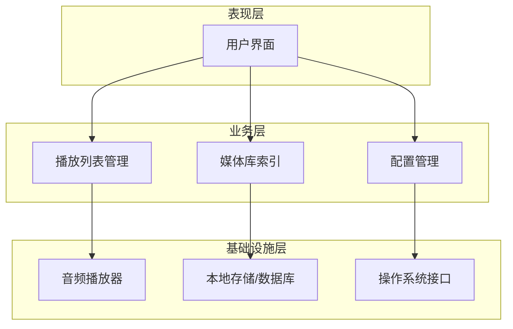

# 快速开始

<cite>
**本文引用的文件**   
- [README.md](file://README.md)
- [README.en.md](file://README.en.md)
</cite>

## 目录
1. [简介](#简介)
2. [项目结构](#项目结构)
3. [核心组件](#核心组件)
4. [架构总览](#架构总览)
5. [详细组件分析](#详细组件分析)
6. [依赖分析](#依赖分析)
7. [性能考虑](#性能考虑)
8. [故障排除指南](#故障排除指南)
9. [结论](#结论)
10. [附录](#附录)

## 简介
本“快速开始”指南面向首次接触“随心听”应用的用户与开发者，目标是帮助你在最短时间内完成环境准备、安装部署与应用启动，并掌握添加音频、创建播放列表、控制播放等基础操作。当前仓库为文档占位阶段，尚未包含可执行代码或构建脚本；因此本节提供通用型前置条件与步骤模板，便于后续接入具体实现后直接替换使用。

## 项目结构
仓库目前仅包含说明文档与需求文档占位文件，未包含源代码、配置文件或构建脚本。建议后续按以下结构组织工程（概念性示意）：
- 前端/客户端：界面与交互逻辑
- 后端/服务：音频管理、播放列表、元数据解析
- 配置与脚本：环境变量、打包与运行脚本
- 文档：使用说明、API 参考、贡献指南

图表来源
- [README.md:1-40](file://README.md#L1-L40)
- [README.en.md:1-37](file://README.en.md#L1-L37)

章节来源
- [README.md:1-40](file://README.md#L1-L40)
- [README.en.md:1-37](file://README.en.md#L1-L37)

## 核心组件
由于仓库中暂无源码与构建定义，无法对实际组件进行代码级分析。建议在后续版本中补充如下模块（概念性描述）：
- 音频播放器：负责解码、缓冲、播放控制
- 播放列表管理器：维护队列、顺序/随机模式、持久化
- 媒体库索引：扫描本地/网络资源，生成元数据
- 用户界面：展示列表、进度、音量、封面等
- 配置中心：读取平台相关设置与路径映射

[本节为概念性内容，不直接分析具体文件]

## 架构总览
在具备完整实现后，典型桌面/移动端音频应用可采用分层架构：UI 层调用业务层，业务层协调媒体引擎与存储层。下图为概念性架构图，用于指导后续开发时的模块划分与职责边界。

[此图为概念性示意，不对应具体源码文件]

## 详细组件分析
当前仓库不包含可执行代码，无法提供函数调用链或类关系图。待引入源码后，将在此处补充：
- 关键类/方法关系图
- 请求处理时序图
- 复杂算法流程图

[本节为概念性内容，不直接分析具体文件]

## 依赖分析
仓库未包含依赖清单或包管理文件，无法进行依赖关系分析。建议在后续版本中添加：
- 语言运行时与 SDK 版本声明
- 第三方库与系统依赖
- 构建工具与插件版本

[本节为概念性内容，不直接分析具体文件]

## 性能考虑
以下为通用优化建议，待实现落地后可结合具体技术栈细化：
- 音频流式加载与预缓冲策略
- 播放列表懒加载与分页渲染
- 媒体元数据异步解析与缓存
- 大目录扫描的增量索引与后台任务
- 内存占用监控与自动回收

[本节为概念性内容，不直接分析具体文件]

## 故障排除指南
基于当前 README 中的安装与使用说明仍为占位文本，常见问题的定位与修复需等待具体实现与日志输出。建议后续完善：
- 明确错误码与日志级别
- 提供最小复现步骤与环境信息收集模板
- 列出各平台的已知限制与兼容矩阵

章节来源
- [README.md:12-22](file://README.md#L12-L22)
- [README.en.md:9-19](file://README.en.md#L9-L19)

## 结论
当前仓库处于文档与需求占位阶段，尚未包含可运行的应用代码与构建配置。请在后续迭代中补充源码、依赖清单与构建脚本，并将本“快速开始”指南中的占位步骤替换为真实的环境要求、安装命令与使用示例，以确保新用户能顺利上手。

[本节为总结性内容，不直接分析具体文件]

## 附录
- 贡献流程：Fork 仓库 → 新建分支 → 提交代码 → 发起 Pull Request
- 多语言说明：可使用不同语言的 README 文件支持多语言读者

章节来源
- [README.md:24-29](file://README.md#L24-L29)
- [README.en.md:21-26](file://README.en.md#L21-L26)