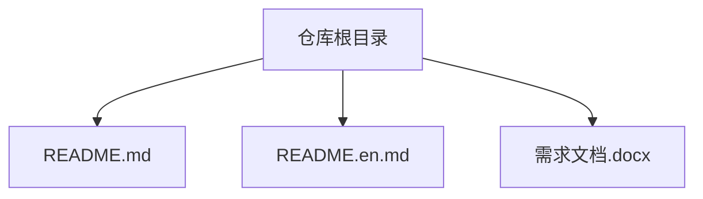
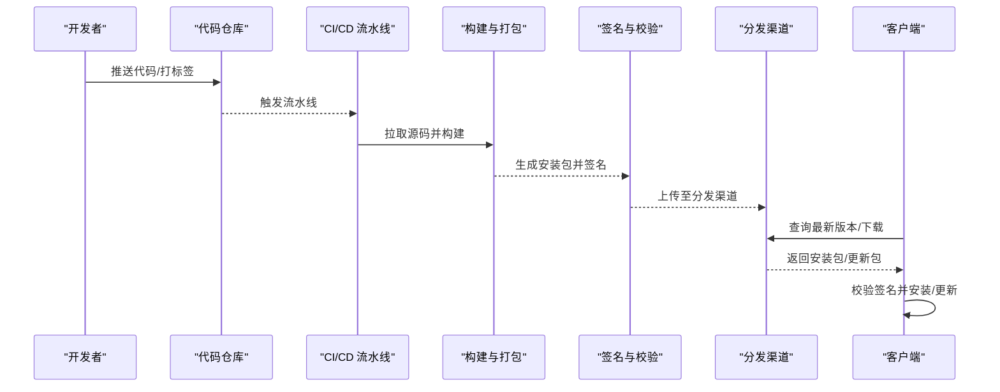

# 部署与发布

<cite>
**本文引用的文件**   
- [README.md](file://README.md)
- [README.en.md](file://README.en.md)
</cite>

## 目录
1. [简介](#简介)
2. [项目结构](#项目结构)
3. [核心组件](#核心组件)
4. [架构总览](#架构总览)
5. [详细组件分析](#详细组件分析)
6. [依赖分析](#依赖分析)
7. [性能考虑](#性能考虑)
8. [故障排查指南](#故障排查指南)
9. [结论](#结论)
10. [附录](#附录)

## 简介
本文件为“随心听”应用的部署与发布指南，目标覆盖 Windows、macOS、Linux 三大平台。内容涵盖构建配置、自动化脚本、安装包制作、签名验证、分发渠道设置、持续集成/持续部署（CI/CD）配置、版本管理策略、发布检查清单、应用更新机制与自动更新配置、生产环境最佳实践与性能优化建议，以及回滚策略与故障恢复方案。

说明：当前仓库仅包含 README 与需求文档，未包含源码或构建配置。因此，本节提供通用且可落地的流程与模板化指引，便于在补齐工程后直接复用。

## 项目结构
当前仓库根目录包含以下关键文件：
- README.md：中文说明与占位信息
- README.en.md：英文说明与占位信息
- 需求文档（Word 格式）：用于业务与功能定义

**图表来源** 
- [README.md:1-40](file://README.md#L1-L40)
- [README.en.md:1-37](file://README.en.md#L1-L37)

**章节来源**
- [README.md:1-40](file://README.md#L1-L40)
- [README.en.md:1-37](file://README.en.md#L1-L37)

## 核心组件
由于仓库尚未包含源代码与构建配置，本节给出“部署与发布”所需的核心工件与职责划分，供后续落地时对照实现：
- 构建产物：各平台的安装包（Windows MSI/EXE、macOS DMG/APP、Linux AppImage/DEB/RPM）
- 签名证书：代码签名证书与时间戳服务器配置
- 分发源：静态资源站点或包管理器仓库（如 Gitee Pages、GitHub Releases、Nexus、APT/YUM 仓库等）
- CI/CD 流水线：触发条件、构建阶段、测试阶段、打包阶段、签名阶段、发布阶段
- 版本与变更：语义化版本号、变更日志、发布标签
- 更新机制：增量/全量更新包、校验签名、灰度与回滚策略

[本节为概念性说明，不直接分析具体文件]

## 架构总览
下图展示多平台打包与发布的端到端流程，从代码提交到用户安装与自动更新的闭环。

[此图为概念流程图，无需图表来源]

## 详细组件分析

### 构建与打包（Windows/macOS/Linux）
- Windows
  - 产物：MSI/EXE
  - 要点：依赖注入、运行时环境检测、安装路径选择、卸载逻辑、UAC 权限处理
- macOS
  - 产物：DMG/APP
  - 要点：App 签名、公证（Notarization）、沙盒能力、权限声明
- Linux
  - 产物：AppImage/DEB/RPM
  - 要点：依赖库打包、系统服务注册、桌面入口、包管理器兼容

[本节为通用指导，不直接分析具体文件]

### 自动化脚本
- 构建脚本：统一入口，按平台参数执行对应构建任务
- 清理脚本：清理缓存与中间产物，保证可重复构建
- 签名脚本：调用平台签名工具，记录签名结果与时间戳
- 上传脚本：将产物推送到指定分发源，并生成访问链接
- 发布脚本：创建 Git 标签、生成变更日志、通知相关方

[本节为通用指导，不直接分析具体文件]

### 安装包制作与签名验证
- 签名流程：私钥签名 -> 附加时间戳 -> 生成校验摘要 -> 产物附带签名与校验文件
- 验证流程：客户端下载后先校验摘要，再验签，通过后安装/更新
- 证书管理：安全存储私钥与密码，使用密钥管理服务或 CI 密钥库

[本节为通用指导，不直接分析具体文件]

### 分发渠道设置
- 静态站点：Gitee Pages/GitHub Releases/对象存储（OSS/S3）
- 包管理器：APT/YUM/DNF 仓库、Homebrew Tap、Chocolatey/NuGet
- 元数据：索引文件、版本映射、镜像同步与 CDN 加速

[本节为通用指导，不直接分析具体文件]

### 持续集成与持续部署（CI/CD）
- 触发条件：push、PR、tag、定时任务
- 阶段设计：
  - 构建：编译、单元测试、静态检查
  - 打包：多平台产物生成
  - 签名：签名与校验
  - 发布：上传分发源、创建发布条目
- 环境隔离：开发/预发/生产环境分离，凭据与配置通过环境变量注入

[本节为通用指导，不直接分析具体文件]

### 版本管理策略
- 语义化版本：主版本.次版本.修订号
- 分支模型：主干+特性分支；发布分支与热修复分支
- 标签规范：vX.Y.Z 对应发布版本
- 变更日志：自动生成或人工维护，记录破坏性变更与已知问题

[本节为通用指导，不直接分析具体文件]

### 发布检查清单
- 代码冻结与合并完成
- 所有测试通过（单元、集成、UI）
- 构建产物齐全（多平台）
- 签名与校验成功
- 分发源可用并可访问
- 变更日志与发布说明已更新
- 回滚预案就绪

[本节为通用指导，不直接分析具体文件]

### 应用更新机制与自动更新配置
- 更新策略：全量/增量；强制/可选；灰度发布
- 更新包：差分算法、压缩、签名与摘要
- 客户端行为：检查更新、下载、校验、安装、重启
- 失败处理：断点续传、重试、降级到上一稳定版

[本节为通用指导，不直接分析具体文件]

### 生产环境部署最佳实践与性能优化
- 最小化依赖：按需引入、静态链接、容器化
- 资源优化：图片/音频压缩、懒加载、缓存策略
- 启动优化：延迟初始化、预加载关键资源
- 监控告警：崩溃上报、性能指标、错误追踪
- 安全加固：HTTPS、证书固定、输入校验、权限最小化

[本节为通用指导，不直接分析具体文件]

### 回滚策略与故障恢复
- 快速回滚：保留上一稳定版本产物，一键切换分发源指向
- 灰度与金丝雀：小流量验证，逐步放量
- 健康检查：发布后自动探测可用性，异常自动回滚
- 数据兼容：数据库迁移可逆或具备补偿脚本

[本节为通用指导，不直接分析具体文件]

## 依赖分析
当前仓库不包含源码与构建配置，无法进行代码级依赖关系分析。建议在补齐工程后补充如下内容：
- 构建系统依赖（如 Node.js、Python、Rust、Go、Java 等）
- 第三方库与许可证合规
- 平台特定依赖（系统库、运行时）
- CI/CD 平台依赖（Docker、签名工具、包管理器）

[本节为概念性说明，不直接分析具体文件]

## 性能考虑
- 构建性能：并行构建、缓存依赖、增量构建
- 产物体积：去重依赖、移除调试符号、按需打包
- 分发性能：CDN 加速、分片下载、断点续传
- 运行性能：内存占用、CPU 峰值、IO 优化

[本节为通用指导，不直接分析具体文件]

## 故障排查指南
- 构建失败：查看构建日志、确认依赖版本与环境变量
- 签名失败：核对证书有效期、时间戳服务器可达性、私钥权限
- 分发不可用：检查网络连通、鉴权凭据、域名解析与 CDN 状态
- 客户端更新失败：检查服务端元数据、签名校验、网络代理与防火墙

[本节为通用指导，不直接分析具体文件]

## 结论
在当前仓库状态下，本文提供了面向多平台的部署与发布全流程模板与实践建议。待工程补齐后，可将上述流程映射到具体构建脚本与 CI/CD 配置中，形成可重复、可审计、可回滚的发布体系。

[本节为总结性内容，不直接分析具体文件]

## 附录

### 参考文件
- [README.md](file://README.md)
- [README.en.md](file://README.en.md)

**章节来源**
- [README.md:1-40](file://README.md#L1-L40)
- [README.en.md:1-37](file://README.en.md#L1-L37)