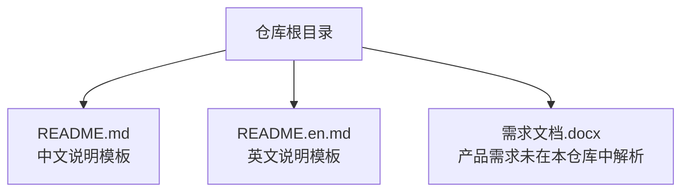
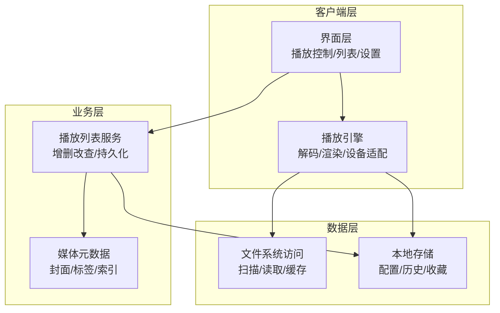

# 项目概述

<cite>
**本文引用的文件**   
- [README.md](file://README.md)
- [README.en.md](file://README.en.md)
</cite>

## 目录
1. [简介](#简介)
2. [项目结构](#项目结构)
3. [核心组件](#核心组件)
4. [架构总览](#架构总览)
5. [详细组件分析](#详细组件分析)
6. [依赖分析](#依赖分析)
7. [性能考虑](#性能考虑)
8. [故障排查指南](#故障排查指南)
9. [结论](#结论)
10. [附录](#附录)

## 简介
随心听是一个面向个人的音频播放应用，目标是提供简洁、稳定、跨平台的桌面端本地音乐体验。当前仓库为项目的文档与说明入口，包含中文与英文的 README 模板内容，用于后续完善安装、使用、贡献等说明。

- 定位：个人桌面端音频播放器
- 目标用户：希望离线管理并播放本地音频文件的个人用户
- 核心价值：轻量、易用、跨平台

[本节不直接分析具体代码文件]

## 项目结构
目前仓库根目录包含以下关键内容：
- README.md：中文说明模板（软件架构、安装教程、使用说明、参与贡献等）
- README.en.md：英文说明模板（对应上述章节的英文版）
- 需求文档（Word 格式）：用于记录产品需求与功能规划（不在本仓库中展开分析）

**图表来源**
- [README.md:1-40](file://README.md#L1-L40)
- [README.en.md:1-37](file://README.en.md#L1-L37)

**章节来源**
- [README.md:1-40](file://README.md#L1-L40)
- [README.en.md:1-37](file://README.en.md#L1-L37)

## 核心组件
基于现有 README 模板的结构，项目将围绕以下能力进行构建与说明：
- 软件架构：描述整体分层与模块职责
- 安装教程：环境准备、依赖安装、构建与运行步骤
- 使用说明：常见操作指引（播放、列表管理、设置等）
- 参与贡献：分支策略、提交规范、PR 流程

以上章节将在后续完善 README 时逐步落地。

**章节来源**
- [README.md:8-29](file://README.md#L8-L29)
- [README.en.md:6-26](file://README.en.md#L6-L26)

## 架构总览
由于当前仓库尚未包含源代码实现，以下为概念性架构示意，帮助理解未来可能的系统组织方式。实际架构将在源码落地后补充精确映射。

[此图为概念性示意，不对应具体源码文件，故不提供图表来源]

## 详细组件分析
当前仓库不包含可执行源码或模块定义，因此无法对具体类、函数或接口进行代码级分析。待源码入库后，将按如下维度展开：
- 类图：展示核心实体与服务之间的关系
- 时序图：描述关键交互流程（如“添加歌曲到播放列表”、“开始播放”）
- 流程图：梳理复杂逻辑（如“本地扫描与索引构建”）

[本节暂不引用具体文件]

## 依赖分析
当前仓库仅包含说明文档与需求文档，无第三方依赖清单或构建脚本。待引入工程文件（如 package.json、Cargo.toml、go.mod、pom.xml 等）后，将在此处补充依赖关系图与版本约束说明。

[本节暂不引用具体文件]

## 性能考虑
在音频播放应用中，常见的性能关注点包括：
- 解码与渲染延迟：优先选择高效解码器与低延迟输出路径
- I/O 吞吐：批量扫描与增量更新，避免全量重复扫描
- 内存占用：按需加载元数据与封面，合理缓存策略
- 并发与线程模型：UI 与后台任务分离，避免阻塞主线程

[本节提供通用建议，不直接分析具体文件]

## 故障排查指南
当 README 中的“安装教程”和“使用说明”完善后，可在其中补充常见问题与排错步骤。现阶段可参考以下通用思路：
- 环境检查：确认操作系统版本、运行时依赖是否满足
- 日志收集：开启调试模式，捕获错误堆栈与关键事件
- 最小复现：隔离问题场景，验证是否为特定文件或权限导致
- 回滚与升级：保留旧版本以便对比，必要时回退至稳定版本

[本节提供通用建议，不直接分析具体文件]

## 结论
当前仓库为随心听项目的文档入口与需求沉淀位置。下一步建议：
- 完善 README 各章节，明确安装、使用与贡献流程
- 引入工程源码与构建脚本，建立清晰的模块划分
- 补充架构图与数据流图，形成开发者快速上手材料

[本节为总结性内容，不直接分析具体文件]

## 附录
- 许可证信息：待仓库根目录添加 LICENSE 文件后在此补充
- 版本历史与更新计划：待引入变更日志（CHANGELOG）或发布说明后在此补充

[本节为占位说明，不直接分析具体文件]